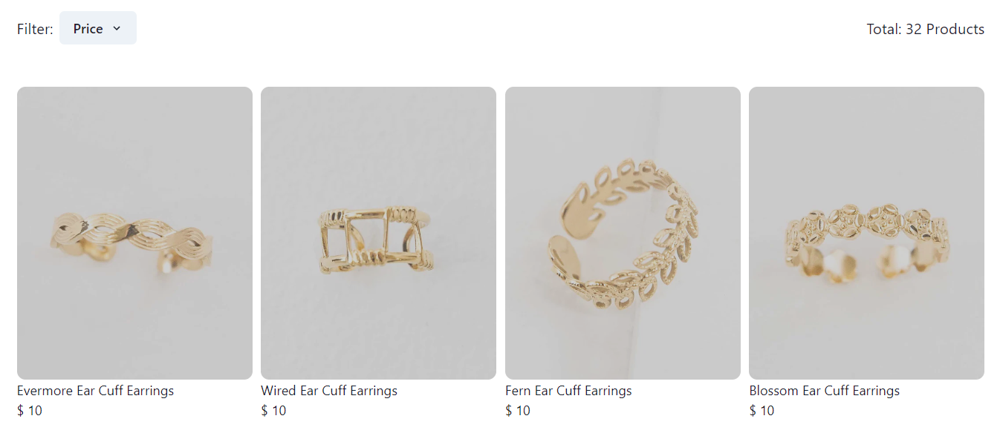

<h2 align="center" >Lovoda</h2>

 <h3>Lovoda is a women's fashion brand website that deals with earrings, rings, bags, necklaces, bracelets and many more established in 2012 in the city of Baltimore, Maryland.</h3>

## Technologies I used
ReactJS | CSS | Chakra UI | HTML 

 ## It is an individual project, developed in 5 days.

<h2>Home Page</h2>

<h2>Login Page</h2>

<h2>Products</h2>

<h2>Admin</h2>

 
 <h3 align="center"><i>Thank You for visiting my Project Repository.</i></h3> 

